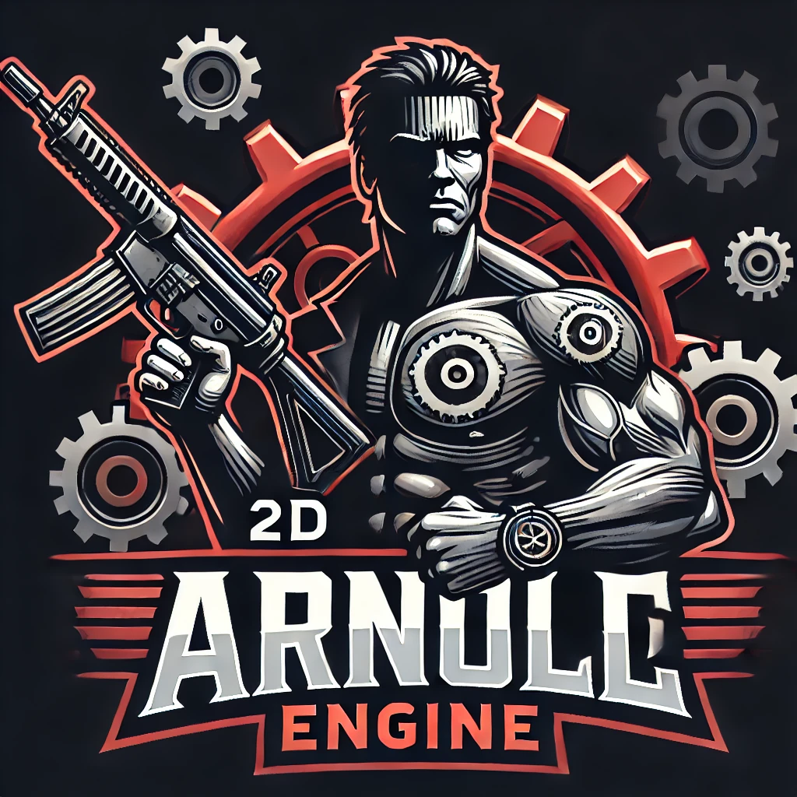

# Arnold Engine



A lightweight 2D Game Engine.

<br><br><br><br><br>

## Install and Setup

### Clone the repository and setup dependencies

Clone the repo:

`git clone --recurse-submodules https://github.com/DavidJCottrell/ArnoldEngine.git`

### Build

Create the build directory:

`mkdir build && cd build`

Build with CMake:

`cmake .. && cmake --build .`

### Adding to a different project's CMakeLists.txt

```
SET(EXTERNAL_LIBS_DIR ${CMAKE_CURRENT_SOURCE_DIR}/external)
add_subdirectory(${EXTERNAL_LIBS_DIR}/ArnoldEngine)
target_link_libraries(ExampleGame ArnoldEngine)
```
